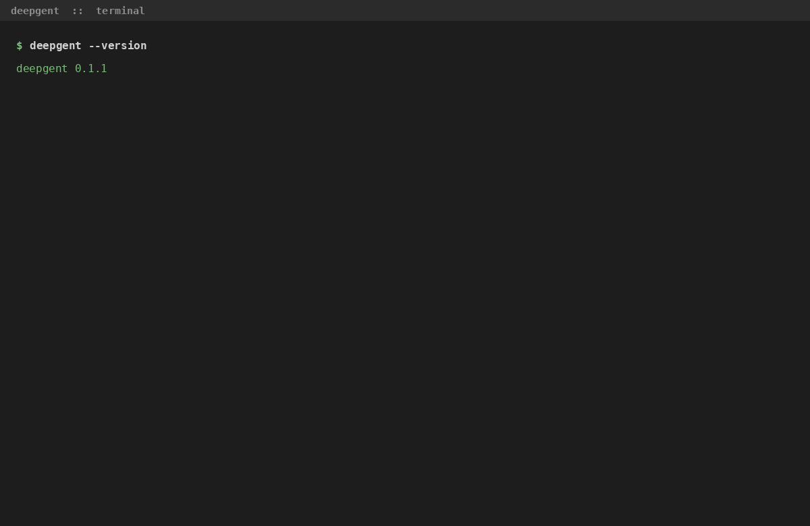
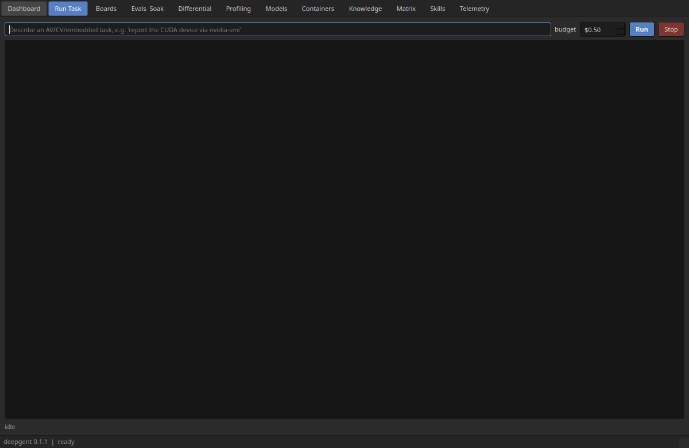
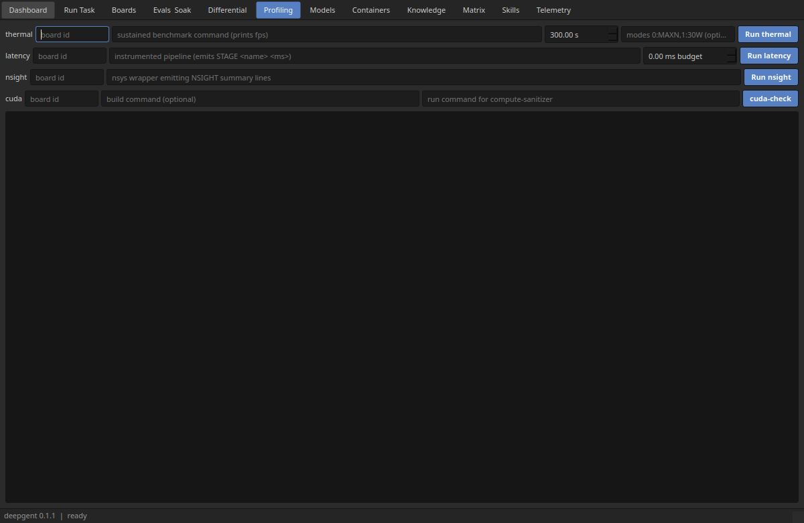
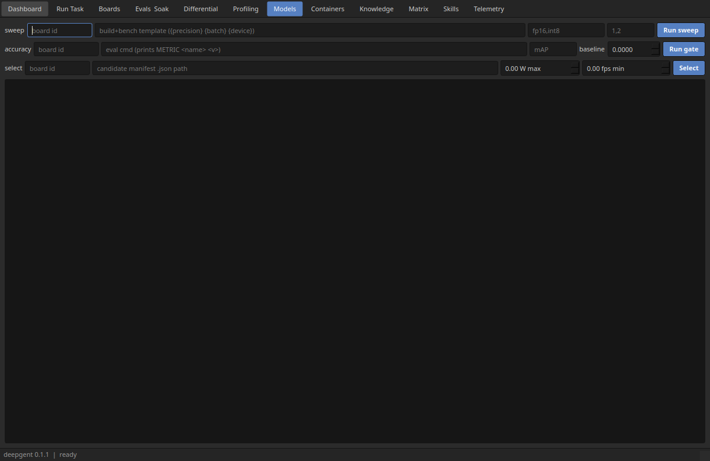
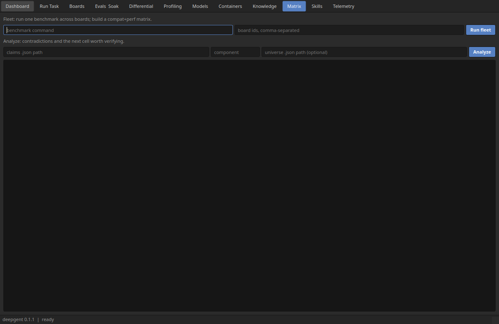

# deepgent

Domain-locked autonomous engineering agent for autonomous vehicles, computer
vision, and embedded systems. Takes a task from natural language to a verified
artifact running on target hardware at spec. Built on the Claude Agent SDK.

Personal project of Sherin Joseph Roy (github.com/Sherin-SEF-AI). Not a
DeepMost AI product.



*Real output: six deepgent CLI commands followed by the same analyses driven
through the desktop GUI. Hardware conflict detection, compatibility-matrix
reasoning, detection mAP scoring, and skill-lift verdicts, all run live.*

## Scope

AV, CV, embedded, and robotics-adjacent edge AI only. The definition of done is
that the artifact runs on target hardware and meets the stated metric (fps, p99
latency, mAP delta, memory, thermal). "Compiles and tests pass" is an
intermediate state, never completion.

## Desktop GUI

A dense, dark, Blender-style desktop app over the full capability surface,
shipped as an optional extra so the core wheel stays dependency-light:

```
uv pip install 'deepgent[gui]'
deepgent gui
```

It runs the whole UI on a single qasync event loop, so deepgent's async core
(orchestrator, board runners, soak, evals) executes without freezing the UI and
without worker threads. Twelve surfaces cover running tasks, profiling,
model/performance analysis, compatibility reasoning, and knowledge.

| Run a task, stream output, watch cost | On-target profiling and gates |
|---|---|
|  |  |
| **Model / performance analysis** | **Compatibility-matrix reasoning** |
|  |  |

## Capabilities

Every feature has a deterministic analysis core (unit-tested without hardware);
on-target execution runs over SSH-attached boards or the local host.

- **Profiling**: sustained thermal/DVFS envelope (burst vs sustained fps,
  thermal knee), glass-to-glass per-stage latency tracer with a p99 budget
  gate, and an Nsight "why is it slow" bottleneck classifier.
- **Model / performance**: TensorRT quantization sweep to an on-target Pareto
  frontier, closed-loop accuracy gate (real VOC mAP / top-k vs a baseline), and
  a power-budget-constrained model selector.
- **Verification gates**: CUDA memory/race safety via compute-sanitizer (the
  GPU analog of the MISRA gate), fleet compat+perf matrix across a board fleet,
  and shadow-mode field-replay diffing between two model versions.
- **Intelligence layer**: a predictive pre-mortem planner (corpus + matrix
  surface known failure modes before planning), confidence-calibrated fact
  arbitration, an empirical skill lifecycle (skills earn context by measured
  lift), a matrix inference engine (transitive inference, contradiction
  detection, active learning), and a reflexion critic that turns tool failures
  into targeted, corpus-grounded replans. The pre-mortem, reflexion, and fact
  confidence fire inside the live task loop.

## CLI

`deepgent "<task>"` runs a task end to end. Representative subcommands:

```
deepgent gui                         # launch the desktop app
deepgent profile thermal   --board agx-orin --workload ./bench --modes 0:MAXN,1:30W
deepgent profile latency   --board agx-orin --command ./pipeline --budget-ms 33
deepgent profile nsight    --board agx-orin --command ./nsys-wrap
deepgent quant-sweep       --board agx-orin --command 'build {precision} {batch} {device}'
deepgent accuracy gate     --board agx-orin --command ./eval --metric mAP --baseline 0.80
deepgent select-model      --board agx-orin --manifest models.json --max-power 15 --min-fps 30
deepgent cuda-check        --board agx-orin --build make --run ./app
deepgent fleet             --boards agx-orin,orin-nx --command ./bench
deepgent shadow            --board agx-orin --fixture drive-01 --incumbent ./v1 --candidate ./v2
deepgent hw-check          --config carrier.json
deepgent matrix analyze    --claims claims.json --component trt10
deepgent premortem         --symptom "int8 on DLA" --hw agx-orin
deepgent reflect           --tool Bash --error "nvcc unsupported gpu architecture"
```

## Development

Python 3.12, managed with [uv](https://docs.astral.sh/uv/):

```
uv sync --all-extras
uv run ruff check
uv run mypy
uv run pytest -m "not hardware"
```

## Status

Phase 0 (bootstrap) is code-complete, and the full profiling, model/performance,
verification, knowledge, and intelligence feature set is built, integrated
(CLI + GUI), and green in CI. Hardware-dependent execution paths are built and
fake-tested; the live on-target runs (and the gt-0001 pass) await the AGX Orin
being online. See CLAUDE.md for the full architecture and phase plan.

## License

Client/harness code is licensed under Apache-2.0. The knowledge layer (`server/`
and skill content) is proprietary and lives behind an authenticated API.
